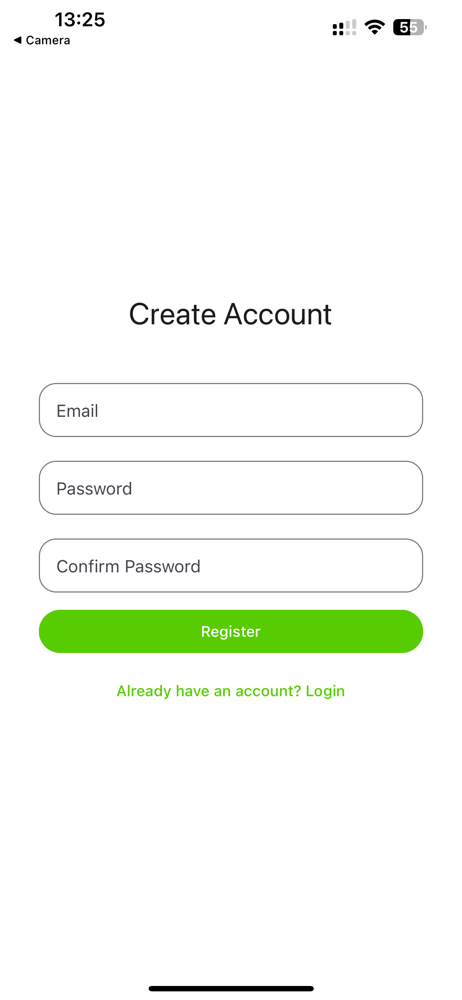
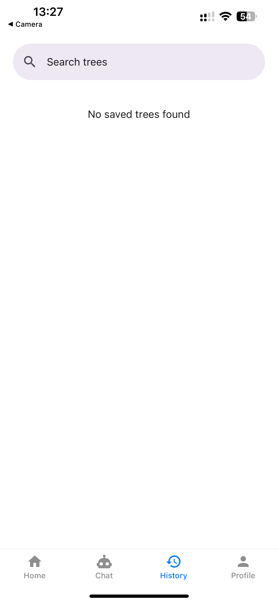

# 🌐 SyntaxAI — Advanced Syntax Tree Generator App

**SyntaxAI** is an advanced mobile application built with [React Native](https://reactnative.dev/) and powered by [`expo-router`](https://docs.expo.dev/router/introduction/), designed for **linguistic analysis**, **syntax visualization**, and **AI-enhanced explanation** of **phrase structure grammars**.

Users can enter complex or simple sentences and receive:
- **Syntactic trees** from underlying **grammar rules**
- **Discourse-level analyses** of multi-clause structures
- **AI explanations** from linguistic theory ( Constituency and dependency grammar)
- Provides a fun and interactive and educational experience for linguists, students and NLP fans.
  
<video src="assets/demo.MP4" controls width="640">
  Sorry, your browser doesn’t support embedded videos.
</video>

---

## 📆 Tech Stack Overview

| Stack | Purpose |
|-------|---------|
| **Expo (React Native)** | Cross-platform app development |
| **Expo Router** | File-based navigation system |
| **Supabase** | Auth, real-time database, secure storage |
| **React Native Paper** | Component library & theming |
| **DeepSeek API** | AI-powered syntactic assistance |
| **TypeScript** | Strongly typed codebase |
| **Custom Grammar Modules** | Core logic for syntax parsing and tree generation |

---

## 🗺️ Project Setup

```bash
npx create-expo-app syntaxai -e with-router
cd syntaxai
npm install
npx expo start
```

---

## 🚀 Running the Project

1. **Clone the repository**  
   ```bash
   git clone https://github.com/akimaliiev/Discourse_and_Grammar.git
   cd Discourse_and_Grammar
2. **Install dependencies**
   ```bash
   npm install
3. **Set up your environment**
   - Create a .env file in the root of the project
   - Add your Supabase URL and anon key:
   ```bash
   SUPABASE_URL=your-project-url
   SUPABASE_ANON_KEY=your-anon-key
4. **Start your development server**
   ```bash
   npx expo start

<p align="start">
  
</p>

<p align="start">
  
</p>

<p align="start">
  
</p>

---

## 📂 Directory Structure

```bash
app/
├── index.tsx                   # Home screen
├── tree/[sentence].tsx         # Dynamic tree for input sentence

components/
├── TreeView.tsx                # Syntax tree renderer
├── ChatBox.tsx                 # AI explanation chat interface
├── InputField.tsx              # Sentence input

lib/
├── parser.ts                   # Tokenizer + grammar rule logic
├── treeBuilder.ts              # Converts rules into tree nodes
├── aiService.ts                # DeepSeek integration

contexts/
├── AuthContext.tsx             # Authentication state
├── TreeContext.tsx             # Shared tree state
```
# 🧠 Linguistic Features

## ✅ Phrase Structure Grammar (PSG)

SyntaxAI uses **phrase structure rules** which follow a structure such as:

S → NP VP
NP → Det N
VP → V NP | V NP PP
PP → P NP

These rules are parsed and visualized as hierarchical grammar trees using the application’s syntax engine.

---

## 🔀 Sentence Types Supported

- **Simple**: *The dog barked.*
- **Compound**: *The dog barked and the cat meowed.*
- **Complex**: *Although it rained, she played.*
- **Interrogatives**: *What did she say?*
- **Passives**: *The book was read by the teacher.*

---

## 🧩 Discourse Grammar

SyntaxAI supports analysis of:
- Clause segmentation
- Subordination & coordination
- Embedded structures
- Contrastive and topical structures

---

## 🎓 Educational Use

- **Linguistics students** can conceptualize transformations on sentences (passive, interrogatives, etc.)
- **Instructors** can create real-time syntactic diagrams while teaching. 
- **Developers** can analyze syntactic parsing for natural language processing (NLP) projects. 

---

## 🔧 App Functions

**Sentence Input & Language Choice**
- The user may enter or paste any sentence and choose from one of the following language options (EN, ES, RU, KZ).

**Tree Creation**
- The central parser applies the CFG and creates an interactive tree diagram.

**AI Explanations**
- For Human Readability, the DeepSeek provides human readable commentary of each constituent (Example, "This NP is doing the work of the subject....").

**Discourse Grammar Analysis**
- The application indicates clauses, coordination, subordination, topicalization, and shows everything in context.

**Tree Functionality**
- There are options to save, edit, export (svg/png), and share trees. The user can access a history option to see what he/she has analyzed in the past.

**Chat Function**
- The user can ask follow-up questions in the live chat panel (e.g., get clarification on parse decisions).

---

# 🛠️ SyntaxAI Development Roadmap

## 📌 Phase 1: Setup & Infrastructure

- ✅ Initialize with `with-router` template
- ✅ Supabase setup with Row-Level Security (RLS)
- ✅ Configuration of ESLint + Prettier
- ✅ Git strategy and branching

<p align="start">
  
</p>

<p align="start">
  
</p>

---

## 🔐 Phase 2: Authentication

- ✅ Registration, login, and password reset
- ✅ Authentication context creation
- ✅ Profile screen with an avatar upload
- ⏳ Language preference selection *(coming soon)*

<p align="center">
  
  
  

</p>

---

## 🌳 Phase 3: Syntax Tree Generation

### 🖼 Tree Visualization

- Clickable, node tree visualizer
- Zoom, pan, expand, and collapse capability

### 🧠 Parsing & Tree Logic

- Sentence tokenizer
- TreeNode object creation which does rule matching
- Multi-language grammar support (English, Spanish, Russian. Kazakh coming soon)

### 🗃 Tree Management

- Saving/loading user tree history
- Tree editing mode *(in process)*
- Exporting trees as SVG/PNG *(coming soon)*


<p align="center">
  
  
  

</p>

---

## 🤖 Phase 4: AI Integration

### 🔌 DeepSeek API

- Grammar rule explanations via LLM
- Prompt-engineered responses
- Contextually-aware and adaptive rephrasing

### 💬 Chat Interface

- Real-time syntax support via chat
- Chat history with scroll persistence
- Typing indicator for AI responses.

<p align="center">
  
  
  

</p>

---

## 🧪 Phase 5: Testing & Deployment

### ✅ Testing

- Unit Testing: both the UI and tree parsing logic.
- Integration Testing: Auth + save/load tree.
- Performance Benchmarks: rendering speed, AI latencies.

### 🚀 Deployment

- Production-ready Expo setup.
- Crash reporting and monitoring.
- Analytics (tree usage and sentence complexity).
- Supabase backup and RLS verification.

---

# 🔧 Development Standards

## ✅ Code Quality

- Strong TypeScript execution.
- Modular and reusable component design.
- Shared hooks and services.
- Descriptive and clean Git commits.

## ⚡ Performance Optimization

- Memorized tree renders.
- Lazy-loaded component for resources.
- Using fewest parsing cycles and API calls to the AI.

## 🔐 Security

- JWT handled securely in context.
- Supabase RLS limits user-level access to their data.
- No sensitive data saved locally.

---

# 📊 Key Metrics of Success

| **Metric**         | **Description**                                |
|--------------------|-------------------------------------------------|
| User Engagement    | Time spent building or analyzing trees          |
| Tree Accuracy      | Match rate to linguistic gold standards         |
| AI Quality         | Relevance and correctness of syntax explanations |
| Retention          | Repeat user percentage                          |
| App Performance    | Rendering and AI response latency               |
| API Health         | Uptime and error rate of Supabase and AI APIs  |


---

## 🏗️ Why We Chose This Tech Stack

**React Native + Expo**
- A cross-platform mobile framework that provides fast refresh, zero-config builds, and is great for rapid prototyping and classroom demos.

**expo-router**
- Provides file-based routing, which brings web conventions to mobile development and allows the use of declarative navigation that we can extend.

**Supabase**
- A managed Postgres backend that provides auth, access control via row-level security, real-time updates, and allows users to avoid the hassle of infrastructure.

**React Native Paper**
- A production ready UI library based on Material design and providing consistent theming and accessibility out of the box.

**DeepSeek API**
- A NLP solution that does syntactic explanations - essentially lets us offload the burden of using heavy AI models to allow the developers to focus more on the UX.

**TypeScript**
- Expanding on strong typing allows developers to catch issues early, provide documentation of data shapes (e.g. tree nodes), and make it almost painless to bring aboard new contributors.

**Custom Grammar Modules**
- Allows us to encapsulate our PSG and dependency rules into isolated libraries, which makes them easy to maintain or extend to new languages.

---

## ➕ Contribution Guidelines

**Branching**
- main for stable releases
- dev for none stable ongoing work
- Feature branches: feature/

**Code Style**
- Follow ESLint/Prettier rules; run npm run lint before PR.

**Testing**
- Add unit tests for any new parser rules or UI components.
- run npm test and cover at least ≥ 80% test coverage.

**Pull Requests**
- Only one feature per PR; reference the issue and screen shot if UI changes.

**Reviews & Merging**
- Require 1 to 2 approvals and maintainers will merge after CI runs successfully.

---

## 🐞 Troubleshooting & FAQs

**“Cannot find module ‘expo-router’”**
- Check that you are using the right Expo SDK version and run npm install.

**Authentication not working on startup**
- Make sure your .env keys match what is on the Supabase dashboard and restart after making edits.

**The tree is not being shown for long sentences**
- Try decreasing the zoom level, or ask shorter questions. We are working on this issue in v1.2.

**Chat responses delayed**
- Make sure your DeepSeek API key is valid and your network allows outbound HTTPS calls.

**Still stuck?**
- Open an issue on github or message in telegram @assetkv.

---

# 📚 References

- [Expo Router Documentation](https://docs.expo.dev/router/introduction/)
- [Supabase Docs](https://supabase.com/docs)
- [React Native Paper](https://callstack.github.io/react-native-paper/)
- [DeepSeek API](https://deepseek.com)
- [X-bar Theory (Linguistics)](https://glossary.sil.org/term/x-bar-theory)
- [Constituency vs Dependency Grammar](https://en.wikipedia.org/wiki/Syntactic_theory)
